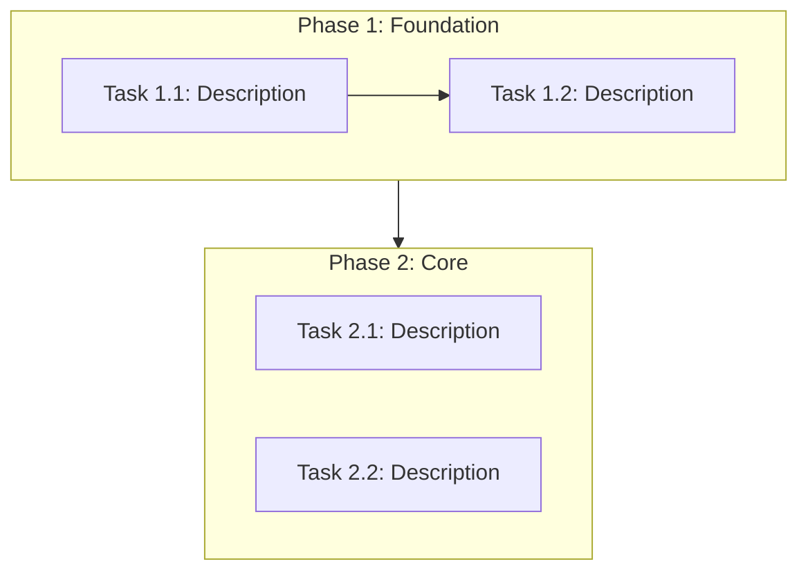

# Document Templates Reference

This file contains the standard templates for all documents generated by the Spec-Driven Develop workflow. When creating documents in `docs/`, use these templates as the starting point and adapt the content to the specific project.

---

## Directory Structure

```
docs/
├── analysis/
│   ├── project-overview.md
│   ├── module-inventory.md
│   └── risk-assessment.md
├── plan/
│   ├── task-breakdown.md
│   ├── dependency-graph.md
│   └── milestones.md
└── progress/
    ├── MASTER.md
    ├── phase-1-<short-name>.md
    ├── phase-2-<short-name>.md
    └── ...
```

---

## Analysis Templates

### project-overview.md

```markdown
# Project Overview

## Task Definition
<!-- One-sentence summary of what this transformation aims to achieve -->

## Current Architecture
<!-- High-level architecture diagram (Mermaid) and description -->

## Technology Stack
| Layer        | Current          | Target           |
|:-------------|:-----------------|:-----------------|
| Language     |                  |                  |
| Framework    |                  |                  |
| Build Tool   |                  |                  |
| Package Mgr  |                  |                  |
| Database     |                  |                  |
| Deployment   |                  |                  |

## Entry Points
<!-- List of main entry points: CLI commands, API endpoints, UI routes, etc. -->

## Build & Run
<!-- How to build, test, and run the project currently -->

## External Integrations
<!-- APIs, databases, services, file systems the project interacts with -->
```

### module-inventory.md

```markdown
# Module Inventory

| Module | Responsibility | Dependencies | Files | Lines | Complexity |
|:-------|:---------------|:-------------|------:|------:|:-----------|
|        |                |              |       |       |            |

## Module Details

### <Module Name>
- **Path**: `src/module_name/`
- **Responsibility**: What this module does
- **Public API**: Key functions/classes exposed to other modules
- **Internal Dependencies**: Which other project modules it imports
- **External Dependencies**: Third-party libraries it uses
- **Complexity Rating**: Low / Medium / High / Critical
- **Transformation Notes**: Specific challenges or considerations for this module
```

### risk-assessment.md

```markdown
# Risk Assessment

## Risk Matrix

| Risk | Impact | Likelihood | Severity | Mitigation |
|:-----|:-------|:-----------|:---------|:-----------|
|      |        |            |          |            |

## High-Severity Risks
<!-- Detailed discussion of each high-severity risk -->

## Technical Debt
<!-- Pre-existing issues that may complicate the transformation -->

## Compatibility Concerns
<!-- API compatibility, data format changes, deployment changes -->
```

---

## Plan Templates

### task-breakdown.md

```markdown
# Task Breakdown

## Overview
- **Total Phases**: N
- **Total Tasks**: N
- **Estimated Total Effort**: S/M/L/XL

## Phase 1: <Phase Name>
**Goal**: What this phase achieves
**Prerequisite**: What must be done before this phase

| # | Task | Priority | Effort | Depends On | Acceptance Criteria |
|:--|:-----|:---------|:-------|:-----------|:--------------------|
| 1 |      | P0       | M      | —          |                     |
| 2 |      | P1       | S      | 1          |                     |

## Phase 2: <Phase Name>
<!-- Same structure as Phase 1 -->
```

### dependency-graph.md

````markdown
# Task Dependency Graph


````

### milestones.md

```markdown
# Milestones

| # | Milestone | Target Phase | Criteria | Status |
|:--|:----------|:-------------|:---------|:-------|
| 1 |           | After Phase 1|          | ⏳     |
| 2 |           | After Phase 3|          | ⏳     |

Status legend: ⏳ Pending, 🔄 In Progress, ✅ Achieved
```

---

## Progress Templates

### MASTER.md (Master Control File)

```markdown
# [Task Name] — Progress Tracker

> **Task**: One-line description
> **Started**: YYYY-MM-DD
> **Last Updated**: YYYY-MM-DD

## References
- [Project Overview](../analysis/project-overview.md)
- [Module Inventory](../analysis/module-inventory.md)
- [Risk Assessment](../analysis/risk-assessment.md)
- [Task Breakdown](../plan/task-breakdown.md)
- [Dependency Graph](../plan/dependency-graph.md)
- [Milestones](../plan/milestones.md)

## Phase Summary

| Phase | Name | Tasks | Done | Progress |
|:------|:-----|------:|-----:|:---------|
| 1     |      |     N |    0 | ⬜⬜⬜⬜⬜ |
| 2     |      |     N |    0 | ⬜⬜⬜⬜⬜ |

## Phase Checklist
- [ ] Phase 1: <name> (0/N tasks) — [details](./phase-1-<name>.md)
- [ ] Phase 2: <name> (0/N tasks) — [details](./phase-2-<name>.md)

## Current Status
<!-- Updated by the agent at the start and end of each work session -->
**Active Phase**: Phase N
**Active Task**: Task description
**Blockers**: None / description

## Next Steps
<!-- What the agent should do next when resuming in a new conversation -->
1. ...
2. ...

## Session Log
<!-- Append-only log of work sessions -->
| Date | Session | Summary |
|:-----|:--------|:--------|
|      |         |         |
```

### phase-N-\<name\>.md (Per-Phase Detail File)

```markdown
# Phase N: <Phase Name>

**Goal**: What this phase achieves
**Status**: Not Started / In Progress / Complete

## Tasks
- [ ] **Task N.1**: Description
  - Acceptance: How to verify this is done
  - Notes: _none yet_
- [ ] **Task N.2**: Description
  - Acceptance: How to verify this is done
  - Notes: _none yet_

## Phase Notes
<!-- Decisions, blockers, context discovered during this phase -->

## Phase Completion Checklist
- [ ] All tasks above are checked off
- [ ] MASTER.md phase count updated
- [ ] MASTER.md "Current Status" updated to next phase
```
```

---

## Sub-SKILL Template

When generating a task-specific sub-SKILL in Phase 4, delegate to the platform's native skill-creator. Provide it with the following information:

- **Name**: `<task-type>-dev` (e.g., `rust-migration-dev`, `microservice-overhaul-dev`)
- **Description**: Should reference the specific task and include trigger keywords
- **Content outline**:
  1. Cross-conversation continuity protocol (read MASTER.md first)
  2. Target technology coding standards and conventions
  3. Progress update instructions (how to update checkboxes and MASTER.md)
  4. Phase-specific development guidance
  5. Cleanup trigger (when all tasks done, initiate cleanup)
